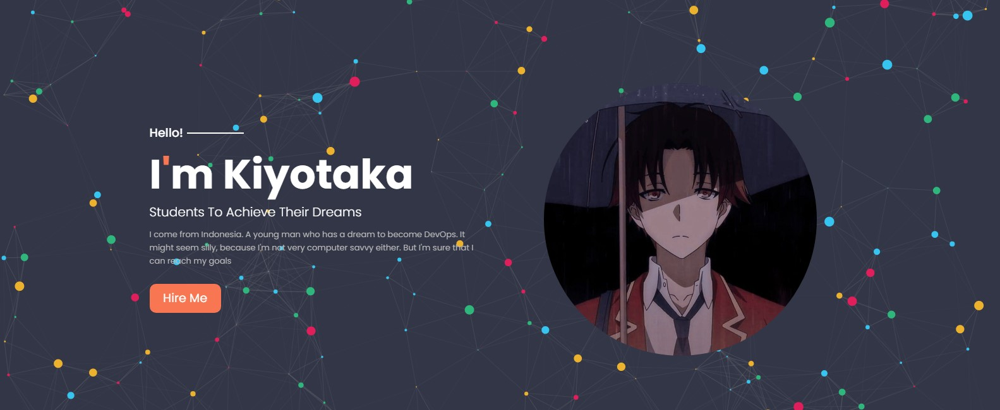
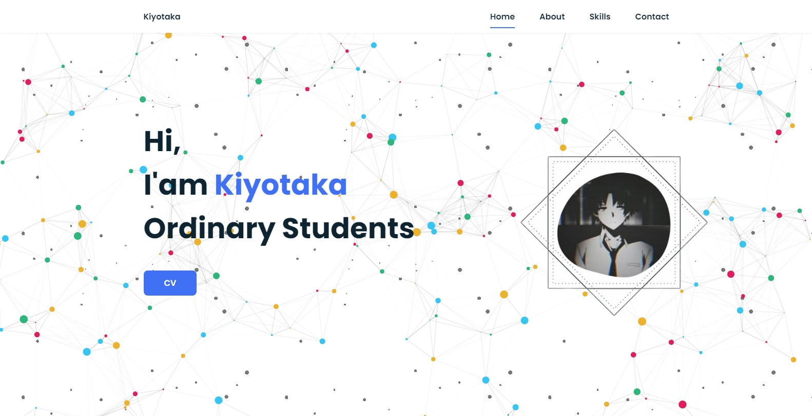

<h1 align="center">Page Portfolio With Particle JS</h1>


```console
Tree
├── style
│   └── style.css
├── portfolio
│   ├── index.html
│   ├── img
|   |   ├── ayanokoji.gif
│   |   ├── bg.gif
│   |   ├── icon.jpg
|   |   ├── kiyo.jpg
|   |   ├── output.jpg
│   |   └── profile.png
|   ├── script
|   |   ├── css
|   |   |   └── style.css
|   |   |── js
│   |   |   ├── app.js
|   |   |   ├── main.js
|   |   |   ├── particles.min.js
│   |   |   └── particles.js
|   |   ├── css          
│   |   |   └── styles.css
|   └───────scss          
│           └── styles.scss
├── js
│   ├── app.js
│   ├── bower.json
|   ├── package.json
|   ├── particles.min.js
│   └── particles.js
├── img
│   ├── icon.jpg
│   ├── kiyo.jpg
│   └── output.jpg
├── index.html
├── LICENSE
└── README.md
```

</p>



</p>


